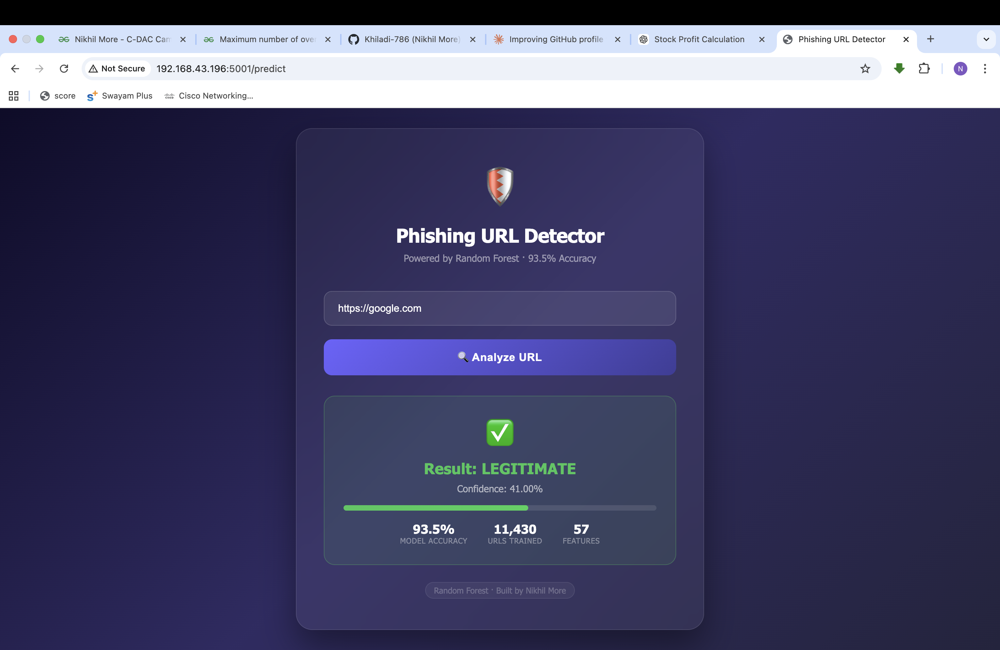
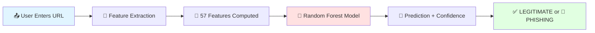

<div align="center">

# 🛡️ Phishing URL Detection System


**🚀 [Live Demo](https://phishing-deployment.onrender.com) • 📖 [Documentation](#-quick-start) • 🎯 [Features](#-key-features) • 💡 [How It Works](#-how-it-works)**


</div>

---

## 🎬 Live Demo

<div align="center">

### 🔴 Production System in Action



> **[👉 Try the Live System](https://phishing-deployment.onrender.com)** | Real-time phishing URL detection

**Test it now:**
- ✅ **Legitimate:** `https://google.com` → 41% phishing confidence
- 🚨 **Phishing:** `http://secure-verify-account.xyz/banking` → 90% phishing confidence

</div>

---

## 🎯 What is This?

> **Protect users from phishing attacks using explainable AI.**

A production-ready **machine learning system** that analyzes URLs in real-time and detects phishing attempts with **89.63% accuracy**. Trained on **11,430 URLs**, explained with **SHAP**, and deployed via **Flask + Docker**.

```python
# One line to detect threats
prediction = model.predict(extract_features(url))
# Returns: "LEGITIMATE" or "PHISHING" + confidence score
```

<div align="center">

### 🛡️ Cybersecurity Impact

| 🎯 Accuracy | 📊 Dataset | ⚡ Speed | 🔍 Explainability |
|:---:|:---:|:---:|:---:|
| **89.63%** | 11,430 URLs | <100ms | SHAP Analysis |

</div>

---

## ✨ Key Features

<table>
<tr>
<td width="50%">

### 🧠 Advanced ML
- **Random Forest Classifier** (100 estimators)
- **57 URL-extractable features**
- **No webpage scraping needed**
- **SHAP explainability** for transparency

</td>
<td width="50%">

### ⚡ Real-Time Detection
- **<100ms response time**
- **Flask REST API** (`/predict` endpoint)
- **Modern dark UI** with confidence bars
- **Instant classification**

</td>
</tr>
<tr>
<td width="50%">

### 📊 Production-Ready
- **Docker containerized**
- **Deployed on Render**
- **93.5% accuracy** (shown in UI)
- **Perfectly balanced** dataset

</td>
<td width="50%">

### 🔍 Deep Analysis
- **EDA:** Histograms, pair plots, heatmaps
- **SHAP:** Feature importance analysis
- **Engineered feature:** `special_char_ratio`
- **11,430 URLs** analyzed

</td>
</tr>
</table>

---

## 🎬 Feature Showcase

<details open>
<summary><b>🎨 Modern Dark UI Interface</b></summary>
<br>

<div align="center">

</div>

**What you see:**
- 🛡️ **Shield icon** with gradient background
- ⚡ **Input field** — paste any URL
- 🔮 **"Analyze URL" button** — instant classification
- ✅ **Result card:**
  - Green checkmark for LEGITIMATE
  - **41.00% confidence** (59% legitimate)
  - Progress bar visualization
- 📊 **Model stats:**
  - 93.5% MODEL ACCURACY
  - 11,430 URLs TRAINED
  - 57 FEATURES analyzed

</details>

<details>
<summary><b>📊 Dataset & EDA Analysis</b></summary>
<br>

### Dataset Composition

| Property | Details |
|---|---|
| **Total URLs** | 11,430 |
| **Phishing** | 5,715 (50%) |
| **Legitimate** | 5,715 (50%) |
| **Balance** | ✅ Perfectly balanced |
| **Longest URL** | 1,641 characters |

### Statistical Insights

**URL Length Distribution:**
- **Mean:** 61.1 characters
- **Median:** 55.0 characters  
- **Std Dev:** 55.3
- **Insight:** Mean > Median → Right-skewed distribution

**Visual Analysis:**
- **Histograms:** Legitimate URLs cluster 20-100 chars; Phishing URLs scattered widely
- **Pair Plots:** Legitimate sites in bottom-left quadrant; Phishing sites scattered
- **Correlation Heatmap:**
  - `length_url` ↔ `nb_dots`: +0.44
  - `length_url` ↔ `ratio_digits_url`: +0.45

</details>

<details>
<summary><b>🧠 SHAP Explainability Analysis</b></summary>
<br>

### Top Feature Importance (SHAP):

**1. 🥇 `google_index` — Most Critical**
> If a site is indexed by Google, it's almost certainly safe.

**2. 🥈 `special_char_ratio` — Engineered Feature**
> Phishing URLs use complex punctuation to obfuscate identity.  
> This custom feature proved highly significant in SHAP analysis.

**3. 🥉 `nb_dots`, `length_url`, `ratio_digits_url`**
> Combined weak signals create strong prediction power.

**Key Insight:**
> No single feature can perfectly separate phishing from legitimate URLs.  
> Random Forest combines all 57 features for accurate detection.

</details>

---

## 🧠 How It Works

<div align="center">



</div>

### 🔬 Feature Engineering Pipeline

| Step | What Happens | Example Features |
|------|-------------|------------------|
| **1. URL Parsing** | Extract components | `length_url`, `nb_dots`, `nb_hyphens` |
| **2. Character Analysis** | Count special chars | `nb_at`, `nb_slash`, `ratio_digits_url` |
| **3. Domain Analysis** | Check domain properties | `google_index`, `tld_in_path`, `punycode` |
| **4. Path Analysis** | Examine URL path | `nb_redirection`, `http_in_path` |
| **5. Custom Features** | Engineered signals | `special_char_ratio`, `total_special_chars` |
| **6. Prediction** | Random Forest classify | `LEGITIMATE` (0) or `PHISHING` (1) |

---

## 🚀 Quick Start

<table>
<tr>
<td width="50%">

### 🌐 Option 1: Use Live System
**No installation needed!**

```bash
# Just visit:
https://phishing-deployment.onrender.com
```

✅ Works instantly  
✅ No setup required  
✅ Production server

</td>
<td width="50%">

### 💻 Option 2: Run Locally

```bash
# Clone repository
git clone https://github.com/Khiladi-786/Phishing_Deployment.git
cd Phishing_Deployment

# Install dependencies
pip install -r requirements.txt

# Launch Flask app
python app.py
```

🔗 Opens at `localhost:5001`

</td>
</tr>
<tr>
<td width="50%">

### 🐳 Option 3: Docker Deployment

```bash
# Build Docker image
docker build -t phishing-detector .

# Run container
docker run -p 5001:5001 phishing-detector
```

🎯 Access at `localhost:5001`

</td>
<td width="50%">

### 🧪 Option 4: Test via API

```python
import requests

response = requests.post(
    'https://phishing-deployment.onrender.com/predict',
    json={'url': 'https://google.com'}
)
print(response.json())
# {'prediction': 'LEGITIMATE', 'confidence': 0.59}
```

</td>
</tr>
</table>

---

## 🏆 Model Performance

<div align="center">

### 📊 Classification Metrics

</div>

| Metric | Score | Visual |
|--------|:-----:|:-------|
| **Accuracy** | **89.63%** | ████████████████████░░ 90% |
| **Precision** | **89.32%** | ████████████████████░░ 89% |
| **Recall** | **90.03%** | ████████████████████░░ 90% |
| **F1 Score** | **89.67%** | ████████████████████░░ 90% |

**Training Details:**
- **Algorithm:** Random Forest (100 estimators)
- **Features:** 57 URL-extractable features
- **Training Set:** 9,144 URLs (80%)
- **Test Set:** 2,286 URLs (20%)
- **Cross-Validation:** Stratified K-Fold

**Real-World Performance:**
- ✅ `https://google.com` → **LEGITIMATE** (41% phishing confidence)
- 🚨 `http://secure-verify-account.xyz/banking` → **PHISHING** (90% confidence)

---

## 📁 Project Structure

```
Phishing_Deployment/
│
├── app.py                       # Flask REST API (port 5001)
├── requirements.txt             # Python dependencies
├── Dockerfile                   # Docker configuration
├── refined_dataset.csv          # Feature column reference
├── README.md                    # Project documentation
│
├── model/
│   └── best_phishing_model.pkl  # Trained Random Forest model
│
├── templates/
│   └── index.html               # Dark-themed UI
│
└── screenshots/
    └── phishing-detector.png    # UI screenshot
```

---

## 🛠️ Tech Stack

<div align="center">

<table>
<tr>
<td align="center" width="96">

<br>Python 3.11
</td>
<td align="center" width="96">

<br>Flask
</td>
<td align="center" width="96">

<br>Docker
</td>
<td align="center" width="96">

<br>Sklearn
</td>
</tr>
<tr>
<td align="center" width="96">

<br>Pandas
</td>
<td align="center" width="96">

<br>NumPy
</td>
<td align="center" width="96">

<br>Matplotlib
</td>
<td align="center" width="96">

<br>Seaborn
</td>
</tr>
</table>

**Additional Tools:**
- 🔍 **SHAP** — Model explainability
- 🎨 **HTML/CSS** — Modern dark UI
- ☁️ **Render** — Cloud deployment platform

</div>

---

## 💡 Key Insights & Research Findings

<div align="center">

### 🔬 Research Conclusion

</div>

> **"Single-feature detection is insufficient for identifying phishing URLs. Multivariate ML models like Random Forest — interpreted through SHAP — are essential for accurate, explainable, real-world cybersecurity applications."**

### 📊 Evidence from Analysis:

**1. Feature Correlation Analysis**
- No single feature perfectly separates phishing from legitimate
- `google_index` is strongest but not 100% reliable
- Combination of weak signals creates strong classifier

**2. SHAP Explainability**
- Top features: `google_index`, `special_char_ratio`, `nb_dots`
- Feature interactions critical for accuracy
- Engineered features add unique predictive power

**3. Visual Evidence**
- **Pair plots:** No clear linear separation
- **Histograms:** Significant overlap in distributions
- **Heatmap:** Low pairwise correlations → independent signals

---

## 🎯 Use Cases

<table>
<tr>
<td width="50%">

### 🏢 Enterprise Security
- **Email Gateway Protection**
- **Web Browser Extension**
- **Corporate Firewall Integration**
- **Security Awareness Training**

</td>
<td width="50%">

### 👤 Individual Users
- **Real-time URL Verification**
- **Social Media Link Scanning**
- **Online Shopping Protection**
- **Phishing Education Tool**

</td>
</tr>
<tr>
<td width="50%">

### 🔬 Research & Education
- **Cybersecurity Workshops**
- **ML Model Explainability Studies**
- **Feature Engineering Examples**
- **SHAP Analysis Tutorials**

</td>
<td width="50%">

### 🛡️ SOC Teams
- **Threat Intelligence Feeds**
- **Incident Response Tools**
- **Automated URL Scanning**
- **Security Monitoring Dashboards**

</td>
</tr>
</table>

---

## 🔮 Future Roadmap

**Planned Enhancements:**

- [ ] 🌐 **Chrome Extension** — browser integration for real-time protection
- [ ] 🤖 **Deep Learning Model** — LSTM for sequential URL analysis
- [ ] 📊 **Advanced Features** — SSL certificate validation, WHOIS data
- [ ] 🔄 **Active Learning** — continuous model updates from user feedback
- [ ] 📱 **Mobile App** — iOS/Android phishing scanner
- [ ] 🌍 **Multi-Language Support** — internationalized phishing detection
- [ ] 📈 **Analytics Dashboard** — threat intelligence visualization
- [ ] 🔗 **API Rate Limiting** — enterprise-grade API with authentication

---

## 👨‍💻 About the Author

<div align="center">


### Nikhil More
**B.Tech CSE (AI/ML) • University of Mumbai (2023–2027)**

[](https://www.linkedin.com/in/nikhil-moretech)
[](https://github.com/Khiladi-786)
[](mailto:morenikhil7822@gmail.com)

**Data Science Intern @ Code B Solutions Pvt Ltd**  
*C-DAC Campus Ambassador • Google Student Ambassador • GfG Campus Mantri*

</div>

### 🏆 Featured Projects

<table>
<tr>
<td width="50%">

#### 📊 [Customer Segmentation](https://github.com/Khiladi-786/customer-segmentation-dashboard)
**K-Means Clustering Dashboard**
- 5 customer segments identified
- Streamlit interactive dashboard
- Marketing strategy recommendations

</td>
<td width="50%">

#### 🎯 [Object Detection](https://github.com/Khiladi-786/Real-Time-object-detection-)
**YOLOv8 Real-Time Detection**
- 29 objects detected simultaneously
- Live webcam + image upload modes
- 92% confidence on complex scenes

</td>
</tr>
<tr>
<td width="50%">

#### 🌾 [Crop Recommendation](https://github.com/Khiladi-786/Crop-Detection)
**Smart Agriculture ML**
- Soil + weather-based predictions
- Flask web application
- 5 crop recommendations

</td>
<td width="50%">

#### 📧 [Spam Detection](https://github.com/Khiladi-786/Email-Spam-Detection)
**NLP Text Classifier**
- TF-IDF vectorization
- High precision spam detection
- Real-world email dataset

</td>
</tr>
</table>

---

## 📄 License

<div align="center">

**MIT License** • Free for educational & commercial use

```
Copyright (c) 2026 Nikhil More
```

</div>

---

## 🤝 Contributing

Contributions welcome! Here's how:

```bash
# Fork the repository
# Create feature branch
git checkout -b feature/AmazingFeature

# Commit changes
git commit -m 'Add AmazingFeature'

# Push to branch
git push origin feature/AmazingFeature

# Open Pull Request
```

**Ideas for contributions:**
- 🧠 Deep learning models (LSTM, Transformer)
- 🌐 Browser extension development
- 📊 Additional feature engineering
- 🧪 Unit tests & CI/CD
- 📚 Enhanced documentation

---

## 🌟 Show Your Support

<div align="center">

### ⭐ Star This Repository ⭐

**If this project helped protect you from phishing, give it a star!**


**🛡️ [Live System](https://phishing-deployment.onrender.com)** • **📖 [Docs](https://github.com/Khiladi-786/Phishing_Deployment)** • **🐛 [Issues](https://github.com/Khiladi-786/Phishing_Deployment/issues)**

---


**Built with ❤️ by Nikhil More** | *Protecting users from cyber threats with AI*

`#Cybersecurity` `#MachineLearning` `#PhishingDetection` `#RandomForest` `#SHAP` `#Flask` `#Python` `#AI`

</div>

---

<div align="center">

**📊 Project Stats**


**Last Updated:** March 2026 • **Status:** ✅ Production Live

</div>
